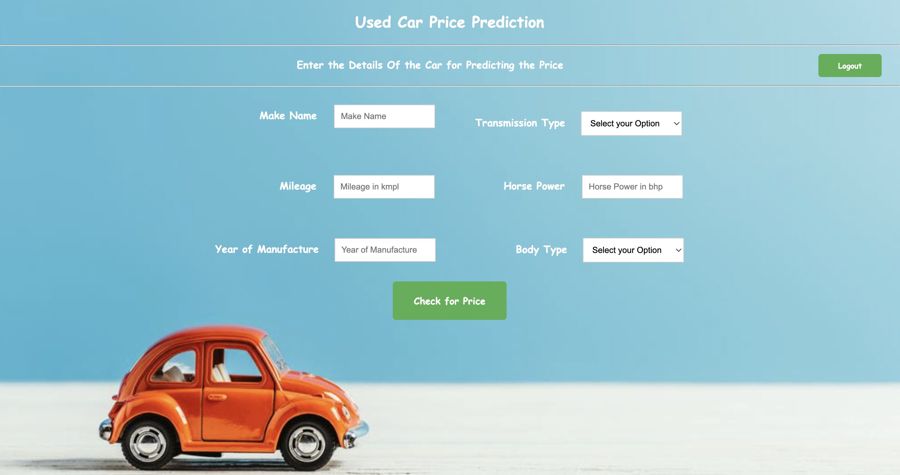

# Used-Car-Price-Prediction

The goal of this project is to estimate used car prices using predictive modeling techniques, which  will be achieved by gathering data from Cargurus, which sells used cars, and studying the various aspects and factors that lead to the actual used car price estimation. To provide consumers with the ability to determine the true value of their vehicle or desired vehicle by just providing a system with a set of features from the desired car to predict the car price.

